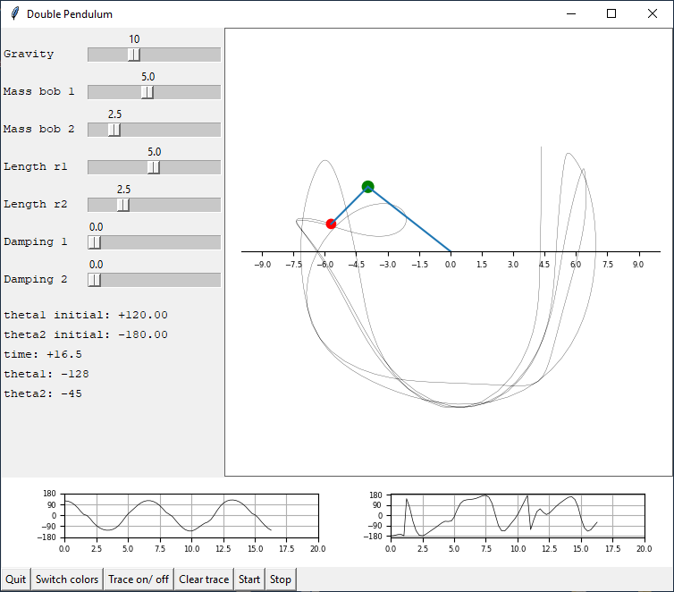

# Double Pendulum

Interesting initial parameters:
Gravity: 9.8
Mass bob 1: 5.0
Mass bob 2: 2.5
Length r1: 5.0
Length r2: 2.5
Damping 1: 0
Damping 2: 0
Initial theta 1: -157.08 degrees
Initial theta 2: +157.35 degrees
Initial angular velocities: 0
